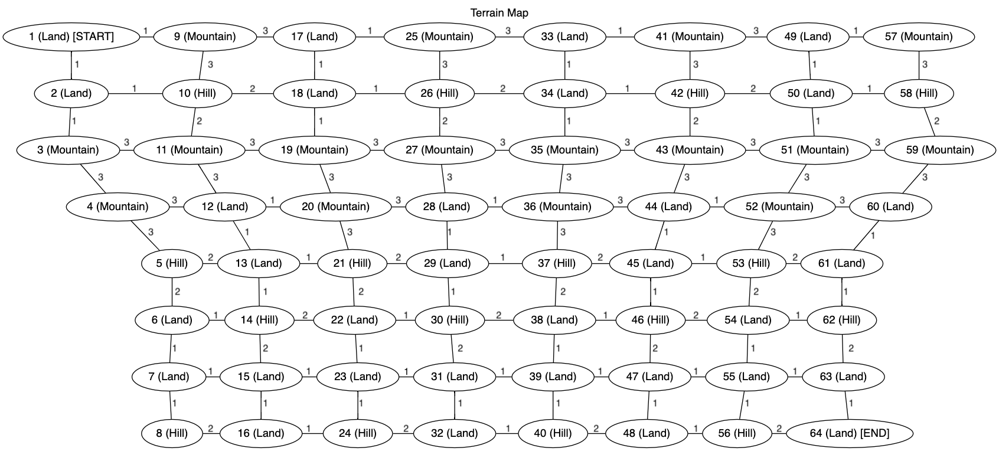

# Gaming Graphs: Graph Algorithms with Tabletop/Board Games

**CISC320 Spring 2023 Lesson 19 - Graph Applications**

Group Members:
* Colby Frashure (cfrashur@udel.edu)
* Second member (email)
* Third member (email)
* Fourth member (email)

The tradition of board games dates back millennia and has been enjoyed by countless generations.
On the other hand, modern graph theory has only developed over the last couple of centuries.
However, as we will demonstrate, the two are more connected than you think; we can use graph
theory to look at and solve our favorite timeless games in brand-new ways. In many ways,
the problems mirror the topic: Like a board game connecting the young and old generations, we
shall connect this ancient pass time with modern theory.

## Installation Code

```sh
$> pip install networkx
```

## Python Environment Setup

```python
import networkx as nx
```

# Tricky Terrain: Shortest Path to the Goal!

**Informal Description**:  
Imagine you have an 8x8 board, with a game piece you must move from one spot of the board to another.
Each space has one of three possible terrains with an associated moving value (MV):
1. Land: Cost 1MV. There are 32 land terrains that can be assigned.
2. Hill: Cost 2MV. There are 16 hill terrains that can be assigned.
3. Mountain: Cost 3MV. There are 16 mountain terrains that can be assigned.

Your objective is to move from the starting spot to the end spot whilst traversing
the least treacherous terrain, or, in other words, with the smallest MV.
You can assume the position of each spot is given a random terrain at the start of the game, so no
planning out your route beforehand! You can also not traverse the board diagonally. Thankfully, we can use 
Dijkstra's Algorithm to find the shortest path from start to finish while minimizing our MV! Neat!

> **Formal Description**:
>  * Input: A weighted, undirected graph *G* = (*V*, *E*, *w*), *s*, and *e*, where *V* is the set of vertices, 
*E* is the set of edges, *w* is the weight function that assigns positive integer to each edge, 
*s* being the starting vertex in *V*, and *e* being the end vertex in *V*.
>  * Output: A set of verticies in *V* representing the shortest path from *s* to *e*.

**Graph Problem/Algorithm**: Single Source Shortest Path (Dijkstra's Algorithm)


**Setup code**:

```python
G = nx.MultiGraph()
elistrow = [(1, 2, 1), (2, 3, 1), (3, 4, 3), (4, 5, 3), (5, 6, 2), (6, 7, 1), (7, 8, 1),
            (9, 10, 3), (10, 11, 2), (11, 12, 3), (12, 13, 1), (13, 14, 1),(14, 15, 2), (15, 16, 1),
            (17, 18, 1), (18, 19, 1), (19, 20, 3), (20, 21, 3), (21, 22, 2), (22, 23, 1), (23, 24, 1)
            (25, 26, 3), (26, 27, 2), (27, 28, 3), (28, 29, 1), (29, 30, 1), (30, 31, 2), (31, 32, 1),
            (33, 34, 1), (34, 35, 1), (35, 36, 3), (36, 37, 3), (37, 38, 2), (38, 39, 1), (39, 40, 1),
            (41, 42, 3), (42, 43, 2), (43, 44, 3), (44, 45, 1), (45, 46, 1), (46, 47, 2), (47, 48, 1),
            (49, 50, 1), (50, 51, 1), (51, 52, 3), (52, 53, 3), (53, 54, 2), (54, 55, 1), (55, 56, 1),
            (57, 58, 3), (58, 59, 2), (59, 60, 3), (60, 61, 1), (61, 62, 1), (62, 63, 2), (63, 64, 1)]
elistcol = [(1, 9, 1), (9, 17, 3), (17, 25, 1), (25, 33, 3), (33, 41, 1), (41, 49, 3), (49, 57, 1),
            (2, 10, 1), (10, 18, 2), (18, 26, 1), (26, 34, 2), (34, 42, 1), (42, 50, 2), (50, 58, 1),
            (3, 11, 3), (11, 19, 3), (19, 27, 3), (27, 35, 3), (35, 43, 3), (43, 51, 3), (51, 59, 3),
            (4, 12, 3), (12, 20, 1), (20, 28, 3), (28, 36, 1), (36, 44, 3), (44, 52, 1), (52, 60, 3),
            (5, 13, 2), (13, 21, 1), (21, 29, 2), (29, 37, 1), (37, 45, 2), (45, 53, 1), (53, 61, 2),
            (6, 14, 1), (14, 22, 2), (22, 30, 1), (30, 38, 2), (38, 46, 1), (46, 54, 2), (54, 62, 1),
            (7, 15, 1), (15, 23, 1), (23, 31, 1), (31, 39, 1), (39, 47, 1), (47, 55, 1), (55, 63, 1),
            (8, 16, 2), (16, 24, 1), (24, 32, 2), (32, 40, 1), (40, 48, 2), (48, 56, 1), (56, 64, 2),]
G.add_weighted_edges_from(elistrow)
G.add_weighted_edges_from(elistcol)
```

**Visualization**:



**Solution code:**

```python
shortest_path = nx.dijkstra_path(G, 1, 64)
print(shortest_path)
```

**Output**

```
[1, 2, 10, 11, 12, 13, 14, 15, 23, 31, 39, 47, 55, 63, 64]
```

**Interpretation of Results**:
Based on the output of our Dijkstra's algorithm, we would need to take the following path for this particular board:
>1 to 2 to 10 to 11 to 12 to 13 to 14 to 15 to 23 to 31 to 39 to 47 to 55 to 63 to 64

This path will result in the minimum MV being used! Hooray for Dijkstra! (Oh, and if you're curious, you'll have an MV of 18.)
