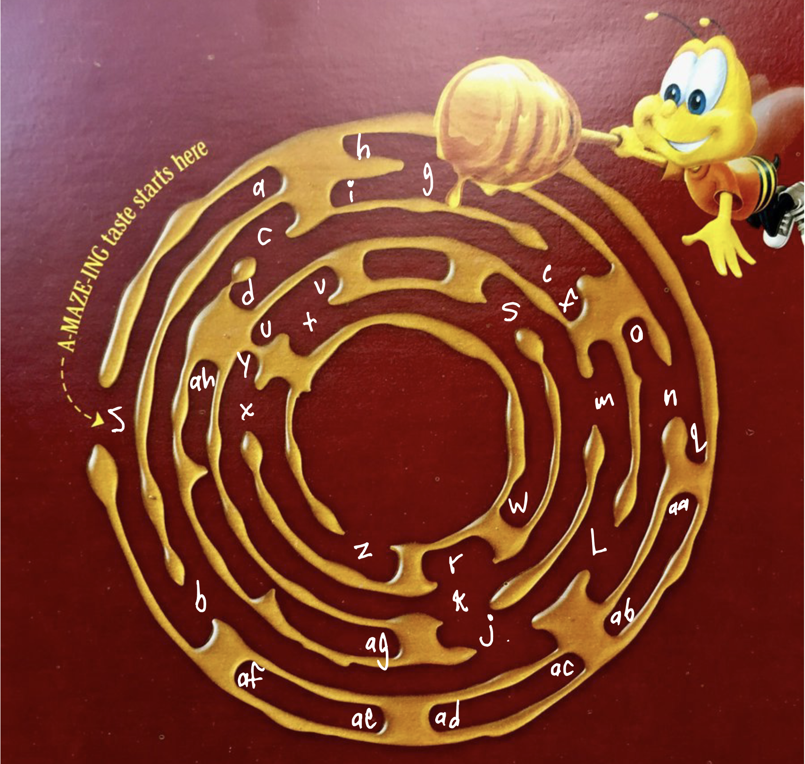
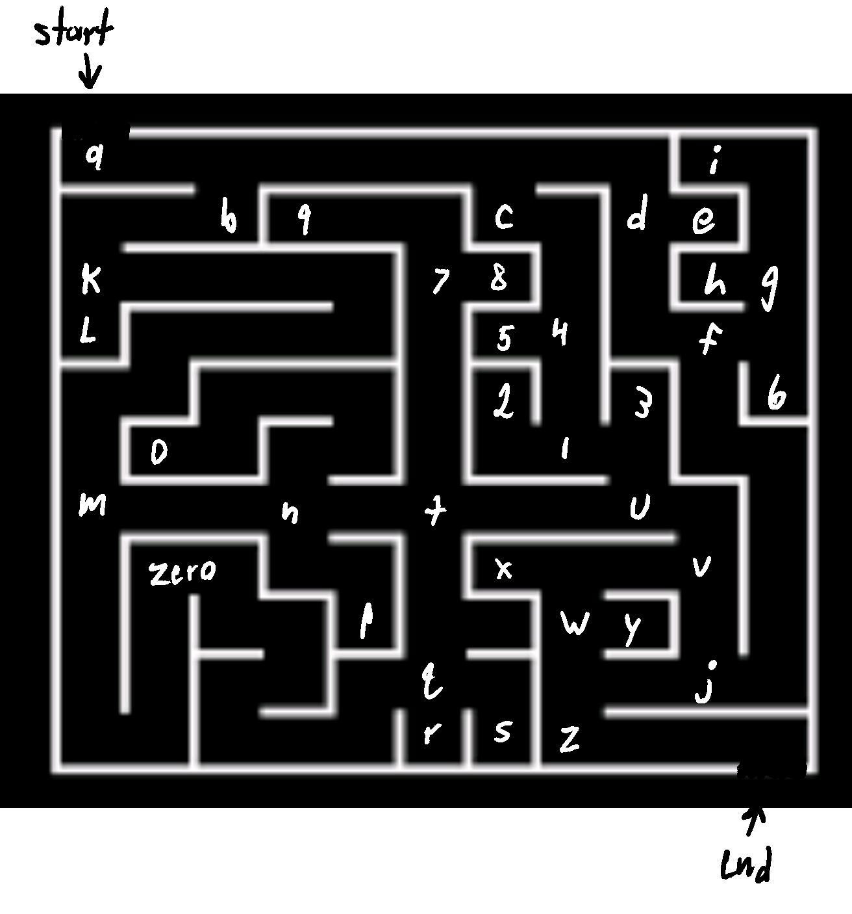
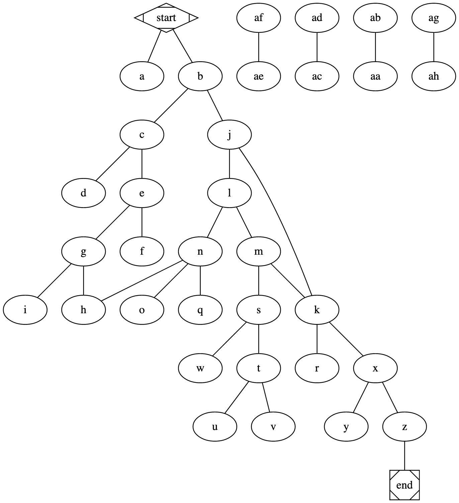
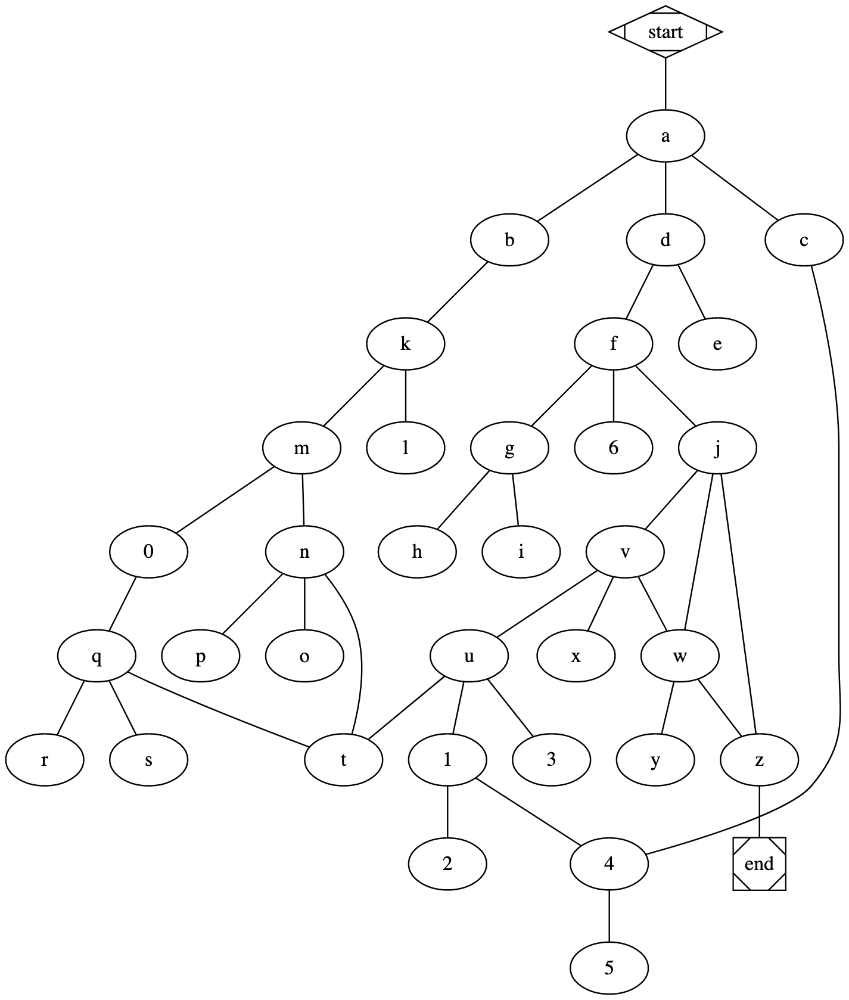

# Gaming Graphs: Graph Algorithms with Tabletop/Board Games

**CISC320 Spring 2023 Lesson 19 - Graph Applications**

Group Members:
* Colby Frashure (cfrashur@udel.edu)
* Andrew Roberts (andrewzr@udel.edu)
* Robert Oratorio (oratorio@udel.edu)
* Fourth member (email)

The tradition of board games dates back millennia and has been enjoyed by countless generations.
On the other hand, modern graph theory has only developed over the last couple of centuries.
However, as we will demonstrate, the two are more connected than you think; we can use graph
theory to look at and solve our favorite timeless games in brand-new ways. In many ways,
the problems mirror the topic: Like a board game connecting the young and old generations, we
shall connect this ancient pass time with modern theory.

## Installation Code

```sh
$> pip install networkx
```

## Python Environment Setup

```python
import networkx as nx
```

# Tricky Terrain: Shortest Path to the Goal!

**Informal Description**:  
Imagine you have an 8x8 board, with a game piece you must move from one spot of the board to another.
Each space has one of three possible terrains with an associated moving value (MV):
1. Land: Cost 1MV. There are 32 land terrains that can be assigned.
2. Hill: Cost 2MV. There are 16 hill terrains that can be assigned.
3. Mountain: Cost 3MV. There are 16 mountain terrains that can be assigned.

Your objective is to move from the starting spot to the end spot whilst traversing
the least treacherous terrain, or, in other words, with the smallest MV.
You can assume the position of each spot is given a random terrain at the start of the game, so no
planning out your route beforehand! You can also not traverse the board diagonally. Thankfully, we can use 
Dijkstra's Algorithm to find the shortest path from start to finish while minimizing our MV! Neat!

> **Formal Description**:
>  * Input: A weighted, undirected graph *G* = (*V*, *E*, *w*), *s*, and *e*, where *V* is the set of vertices, 
*E* is the set of edges, *w* is the weight function that assigns positive integer to each edge, 
*s* being the starting vertex in *V*, and *e* being the end vertex in *V*.
>  * Output: A set of verticies in *V* representing the shortest path from *s* to *e*.

**Graph Problem/Algorithm**: Single Source Shortest Path (Dijkstra's Algorithm)


**Setup code**:

```python
G = nx.MultiGraph()
elistrow = [(1, 2, 1), (2, 3, 1), (3, 4, 3), (4, 5, 3), (5, 6, 2), (6, 7, 1), (7, 8, 1),
            (9, 10, 3), (10, 11, 2), (11, 12, 3), (12, 13, 1), (13, 14, 1),(14, 15, 2), (15, 16, 1),
            (17, 18, 1), (18, 19, 1), (19, 20, 3), (20, 21, 3), (21, 22, 2), (22, 23, 1), (23, 24, 1)
            (25, 26, 3), (26, 27, 2), (27, 28, 3), (28, 29, 1), (29, 30, 1), (30, 31, 2), (31, 32, 1),
            (33, 34, 1), (34, 35, 1), (35, 36, 3), (36, 37, 3), (37, 38, 2), (38, 39, 1), (39, 40, 1),
            (41, 42, 3), (42, 43, 2), (43, 44, 3), (44, 45, 1), (45, 46, 1), (46, 47, 2), (47, 48, 1),
            (49, 50, 1), (50, 51, 1), (51, 52, 3), (52, 53, 3), (53, 54, 2), (54, 55, 1), (55, 56, 1),
            (57, 58, 3), (58, 59, 2), (59, 60, 3), (60, 61, 1), (61, 62, 1), (62, 63, 2), (63, 64, 1)]
elistcol = [(1, 9, 1), (9, 17, 3), (17, 25, 1), (25, 33, 3), (33, 41, 1), (41, 49, 3), (49, 57, 1),
            (2, 10, 1), (10, 18, 2), (18, 26, 1), (26, 34, 2), (34, 42, 1), (42, 50, 2), (50, 58, 1),
            (3, 11, 3), (11, 19, 3), (19, 27, 3), (27, 35, 3), (35, 43, 3), (43, 51, 3), (51, 59, 3),
            (4, 12, 3), (12, 20, 1), (20, 28, 3), (28, 36, 1), (36, 44, 3), (44, 52, 1), (52, 60, 3),
            (5, 13, 2), (13, 21, 1), (21, 29, 2), (29, 37, 1), (37, 45, 2), (45, 53, 1), (53, 61, 2),
            (6, 14, 1), (14, 22, 2), (22, 30, 1), (30, 38, 2), (38, 46, 1), (46, 54, 2), (54, 62, 1),
            (7, 15, 1), (15, 23, 1), (23, 31, 1), (31, 39, 1), (39, 47, 1), (47, 55, 1), (55, 63, 1),
            (8, 16, 2), (16, 24, 1), (24, 32, 2), (32, 40, 1), (40, 48, 2), (48, 56, 1), (56, 64, 2),]
G.add_weighted_edges_from(elistrow)
G.add_weighted_edges_from(elistcol)
```

**Visualization**:


**Solution code:**

```python
shortest_path = nx.dijkstra_path(G, 1, 64)
print(shortest_path)
```

**Output**

```
[1, 2, 10, 11, 12, 13, 14, 15, 23, 31, 39, 47, 55, 63, 64]
```

**Interpretation of Results**:
Based on the output of our Dijkstra's algorithm, we would need to take the following path for this particular board:
>1 to 2 to 10 to 11 to 12 to 13 to 14 to 15 to 23 to 31 to 39 to 47 to 55 to 63 to 64

This path will result in the minimum MV being used! Hooray for Dijkstra! (Oh, and if you're curious, you'll have an MV of 18.)


# Buzz-worthy Maze: Find Your Way In

**Informal Description:**
Mazes have been a challenging source of entertainment for people of all ages for centuries. From the childhood joy of solving mazes in puzzle books to haunted houses and corn mazes, we all have some memory associated with mazes. Here we have a buzz-worthy maze from the back of a box of Cheerios. Our objective is to find a way from the outside to the center of the honey spilled by the menacing bee.


*I've taken the liberty of labeling each vertex with a letter*

If bees and honey aren't your style and you would like a bit more of a challenge we have also prepared a more standard looking maze that is a bit more of a challenge to solve. This maze has more than 1 solution giving it a slightly denser graph making networkx's work more fun.



>**Formal Description:**
> * Input: An unweighted, undirected graph G = (V, E), s, where V is the set of verticies (maze junctions), E is the set of edges (paths connecting junctions), and s being the starting vertex in V.
> * Output: A set of verticies in V representing the search through the maze

**Graph Problem/Algorithm:** DFS

**Setup Code:**

*Cheerios Maze:*
```python
import networkx as nx

G = nx.Graph()
G.add_edges_from([('start', 'a'), ('start', 'b'), ('b', 'c'), ('b', 'j'), ('c', 'd'), ('c', 'e'), ('e', 'f'), ('e', 'g'), ('g', 'h'), ('g', 'i'), ('j', 'k'), ('k', 'r'), ('j', 'l'), ('l', 'm'), ('l', 'n'), ('m', 'k'), ('n', 'o'), ('n', 'q'), ('n', 'h'), ('k', 'x'), ('x', 'y'), ('x', 'z'), ('m', 's'), ('s', 'w'), ('s', 't'), ('t', 'u'), ('t', 'v'), ('z', 'end')])
```

*Harder Maze:*
```python
import networkx as nx

G = nx.Graph()
G.add_edges_from([('start', 'a'), ('a', 'b'), ('a', 'c'), ('a', 'd'), ('d', 'e'), ('d', 'f'), ('f', 'g'), ('f', '6'), ('g', 'h'), ('g', 'i'), ('f', 'j'), ('j', 'z'), ('j', 'v'), ('v', 'x'), ('v', 'w'), ('w', 'y'), ('w', 'z'), ('w', 'j'), ('v', 'u'), ('u', 't'), ('u', '3'), ('u', '1'), ('1', '2'), ('1', '4'), ('4', '5'), ('4', 'c'), ('b', 'k'), ('k', 'l'), ('k', 'm'), ('m', '0'), ('m', 'n'), ('n', 'o'), ('n', 'p'), ('n', 't'), ('0', 'q'), ('q', 't'), ('q', 'r'), ('q', 's'), ('z', 'end')])
```

**Cheerios Visualization:**


**Harder MAze Visualization:**


**Solution Code:**

```python
N = nx.dfs_preorder_nodes(G)
dfs = list(N)
print(dfs)
```

**Output**

*Cheerios Maze:*
```
['start', 'a', 'b', 'c', 'd', 'e', 'f', 'g', 'h', 'n', 'l', 'j', 'k', 'r', 'm', 's', 'w', 't', 'u', 'v', 'x', 'y', 'z', 'end', 'o', 'q', 'i']
```

*Harder Maze:*
```
['start', 'a', 'b', 'k', 'l', 'm', '0', 'q', 't', 'u', 'v', 'j', 'f', 'd', 'e', 'g', 'h', 'i', '6', 'z', 'w', 'y', 'end', 'x', '3', '1', '2', '4', '5', 'c', 'n', 'o', 'p', 'r', 's']
```

**Interpretation of Results:**
These lists show the order that the DFS algorithim took as it searched the the mazes starting at the 'start' vertex. Since this is a pre-order search, it always tries the leftmost vertex first before backtracking and trying the other vertex. From the Cheerios output we see that starting at the 'start' vertex it attempted to go the route of 'a' only to find that it was a dead end so it backtracked and moved to the 'b' vertex which branches from 'start'. It searches the verticies accessible down a path until it reaches a dead end like it did with 'i' and backtracks to the previous split that it didn't search.

# Branches of Power - Skill Tree Traversal

**Informal Description**:  
Popular RPG game Branches of Power has a skill tree that players must use when they level up. Players must choose between classes of attack, magic, and defense & range. As they level up, they progress through the classes and choose new skills to unlock. A new player will want to quickly gain xp so they can max out their skill tree and learn all the possible abilities.

The objective is to unlock all skills in as little steps as possible. This way, a player can maximize the speed at which they reach the highest level.

DFS can be used to find the shortest path to unlock all skills in the unweighted skill tree.

> **Formal Description**:
>  * Input: A weighted, undirected graph *G* = (*V*, *E*), and *s*, where *V* is the set of vertices, *E* is the set of edges, and *s* is the starting vertex in *V*.
>  * Output: A set of edges in *E* representing the shortest path to visit every node starting from *s*. Also the number of edges in this shortest path.

**Graph Problem/Algorithm:** BFS

**Setup Code:**

*Cheerios Maze:*
```python
import networkx as nx

g = nx.Graph()
g.add_edge("Starting_Skill", "First_Powerup")
g.add_edge("First_Powerup", "Defense_Range_Starter")
g.add_edge("First_Powerup", "Magic_Starter")
g.add_edge("First_Powerup", "Attack_Starter")
g.add_edge("Defense_Range_Starter", "Bow_Arrow")
g.add_edge("Defense_Range_Starter", "Iron_Shield")
g.add_edge("Bow_Arrow", "Crossbow")
g.add_edge("Bow_Arrow", "Elemental_Arrows")
g.add_edge("Crossbow", "Elemental_Arrows")
g.add_edge("Magic_Starter", "Magic_Wand")
g.add_edge("Magic_Starter", "Learn_Spells")
g.add_edge("Magic_Wand", "Ice_Cast")
g.add_edge("Magic_Wand", "Fire_Cast")
g.add_edge("Learn_Spells", "Ice_Cast")
g.add_edge("Learn_Spells", "Fire_Cast")
g.add_edge("Learn_Spells", "Magic_Shield")
g.add_edge("Iron_Shield", "Magic_Shield")
g.add_edge("Ice_Cast", "Elemental_Arrows")
g.add_edge("Fire_Cast", "Elemental_Arrows")
g.add_edge("Fire_Cast", "Flaming_Sword")
g.add_edge("Attack_Starter", "Iron_Shield")
g.add_edge("Attack_Starter", "Iron_Sword")
g.add_edge("Attack_Starter", "Light_Armor")
g.add_edge("Iron_Shield", "Light_Armor")
g.add_edge("Light_Armor", "Assassin_Dagger")
g.add_edge("Attack_Starter", "Assassin_Dagger")
g.add_edge("Assassin_Dagger", "Dual_Weild")
g.add_edge("Iron_Sword", "Broadsword")
g.add_edge("Iron_Sword", "Greatsword")
g.add_edge("Iron_Sword", "Dual_Weild")
g.add_edge("Broadsword", "Greatsword")
g.add_edge("Broadsword", "Flaming_Sword")
```

**Skill Tree Visualization:**


**Solution Code:**

```python
N = nx.bfs_edges(g, 'Starting_Skill')
bfs = list(N)
print(len(bfs))
print(bfs)
```

**Output:**
```
20
[('Starting_Skill', 'First_Powerup'), ('First_Powerup', 'Defense_Range_Starter'), ('First_Powerup', 'Magic_Starter'), ('First_Powerup', 'Attack_Starter'), ('Defense_Range_Starter', 'Bow_Arrow'), ('Defense_Range_Starter', 'Iron_Shield'), ('Magic_Starter', 'Magic_Wand'), ('Magic_Starter', 'Learn_Spells'), ('Attack_Starter', 'Iron_Sword'), ('Attack_Starter', 'Light_Armor'), ('Attack_Starter', 'Assassin_Dagger'), ('Bow_Arrow', 'Crossbow'), ('Bow_Arrow', 'Elemental_Arrows'), ('Iron_Shield', 'Magic_Shield'), ('Magic_Wand', 'Ice_Cast'), ('Magic_Wand', 'Fire_Cast'), ('Iron_Sword', 'Broadsword'), ('Iron_Sword', 'Greatsword'), ('Iron_Sword', 'Dual_Weild'), ('Fire_Cast', 'Flaming_Sword')]
```

**Interpretation of Results:**
The list shows the order that the BFS algorithim took as it searched through the skill tree starting at the 'Starting_Skill' vertex. The number gives the number of edges in the skill tree, which is the amount of times a player needs to level up in order to max out their skill set. The list gives the order that a player needs to choose their skills in order to reach their max skills as quickly as possible. 